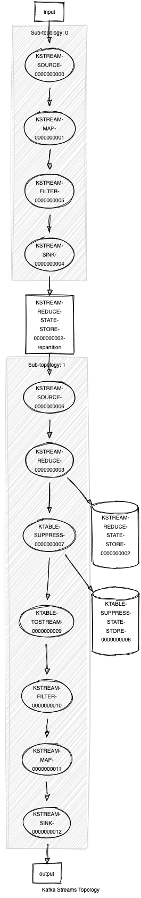

# Kafka Streams Challenge

## Overview
Your task is to create a Kafka Streams job. It needs to consume all events from topic "input".
The events in the input topic have the following text based format:
```ebnf
<Id>     ::= <number>
<Action> ::= START | END
<Event>  ::= <Id>,<Action>
```
The Kafka Streams job should emit an event to topic "output" if for an Id there was a START-Event followed by an END-Event 
within 1 minute and no further START-Event for at least 1 more minute. The event in the output topic should have the 
Id (as text) as value.

The requirements are listed below. Beside those requirements you are free to solve the problem as you prefer 
(i.e. it is your decision which tools to use) with the restriction that your result needs to be verifiable 
by us (don't use tools we can't access).

## Requirements
*AS* BA Team
*I WANT* to monitor the input-topic for END events arriving after START events
*SO THAT* I can create alerts based on that information

*AS* BA Team
*I WANT* have metrics of the Kafka Streams application
*SO THAT* I notice when the job is failing  
Minimum version: define useful metrics, alerts

## How to run it
Build code and create docker image:
```
./gradlew clean build && docker image build -t kafka-streams-challenge .
```
Run docker compose file:
```
docker-compose up -d
```
Unfortunately I can't find a way how to produce multiline text message via kafka console producer(maybe it is not possible).
But [kcat](https://github.com/edenhill/kcat) can do it. It didn't work via docker :) for me, so I had to install it.
```yaml
brew install kcat
```
Produce message(I had to enter it line by line :( ):
```
kcat -b localhost:29092 \
-t input \
-D/ \
-P <<EOF
<Id>     ::= 1
<Action> ::= START
<Event>  ::= 1,START
EOF
```
Check final output topic:
```
kcat -b localhost:29092 -t output
```
Stop docker compose
```
docker-compose down
```

## Metrics
Prometheus and Grafana added to monitor KafkaStreams metrics.
You can check out alert rules here: http://localhost:3000/alerting/list
Username/Password is **admin/admin**.
To see effect of applied rule, you can produce for example not parseable message:
```
<Id>     ::= 1
<Action> ::= END
<Event>  ::= wrong
```
We can also create a general kafka alert when consumer lag is growing (You can see it from `kafka-lag-exporter` dashboard).

## Other
There is a nice [tool](https://github.com/zz85/kafka-streams-viz) to visualize KStreams topology. My looks as follows :):

